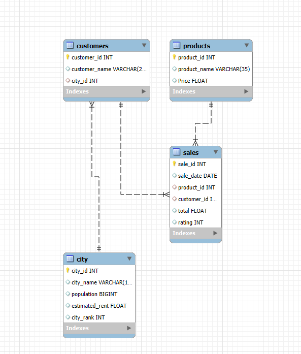

# ☕ Monday Coffee — SQL Expansion Analysis

> *A data-driven approach to identifying the top three cities in India for Monday Coffee's first physical store expansion.*

---

## 📌 Objective

Monday Coffee has been selling its products online since January 2023. This project dives deep into historical sales data using **SQL** to uncover which cities hold the greatest potential for opening physical stores — based on consumer demand, revenue performance, and market efficiency.

---

## 🗂️ Dataset Overview

The dataset contains four interconnected tables:

| Table | Description |
|---|---|
| `city` | City-level data — population, estimated rent, city rank |
| `customers` | Customer demographics and their associated city |
| `products` | Coffee product catalogue with pricing |
| `sales` | All transaction records with ratings and totals |

---

## 🛠️ Tech Stack

- **Database:** MYSQL  
- **Language:** SQL — DDL, DML, Aggregations, Joins, Subqueries, Window Functions  
- **Data Prep:** Microsoft Excel  

---

## 🧱 Schema Setup

```sql
-- Monday Coffee DB Schema

CREATE TABLE city (
    city_id       INT PRIMARY KEY,
    city_name     VARCHAR(15),
    population    BIGINT,
    estimated_rent FLOAT,
    city_rank     INT
);

CREATE TABLE customers (
    customer_id   INT PRIMARY KEY,
    customer_name VARCHAR(25),
    city_id       INT,
    CONSTRAINT fk_city FOREIGN KEY (city_id) REFERENCES city(city_id)
);

CREATE TABLE products (
    product_id    INT PRIMARY KEY,
    product_name  VARCHAR(35),
    price         FLOAT
);

CREATE TABLE sales (
    sale_id       INT PRIMARY KEY,
    sale_date     DATE,
    product_id    INT,
    customer_id   INT,
    total         FLOAT,
    rating        INT,
    CONSTRAINT fk_products  FOREIGN KEY (product_id)  REFERENCES products(product_id),
    CONSTRAINT fk_customers FOREIGN KEY (customer_id) REFERENCES customers(customer_id)
);
```

> **Import order:** `city` → `products` → `customers` → `sales`

---

## 🗺️ Entity Relationship Diagram



---

## 🔍 Business Questions & SQL Solutions

### Q1. Coffee Consumers Count
*How many people in each city are estimated to consume coffee, assuming 25% of the population does?*

```sql
SELECT 
    city_name,
    (population * .25) / 1000000 AS coffee_consumer,
    city_rank
FROM
    city
ORDER BY 2 DESC ;
```

---

### Q2. Total Revenue from Coffee Sales
*What is the total revenue generated across all cities in Q4 2023?*

```sql
SELECT ci.city_name,
    SUM(s.total) AS total_revenue
FROM
    sales s
    JOIN customers AS c ON s.customer_id = c.customer_id 
    JOIN city AS ci ON ci.city_id = c.city_id
WHERE
    YEAR(sale_date) = 2023
        AND QUARTER(sale_date) = 4
        GROUP BY 1 
        ORDER BY 2 DESC;
```

---

### Q3. Sales Count for Each Product
*How many units of each coffee product have been sold?*

```sql
SELECT 
    P.product_name, COUNT(S.sale_id) AS Total_orders
FROM
    products AS p
        LEFT JOIN
    sales AS s ON s.product_id = p.product_id
GROUP BY 1
ORDER BY 2 DESC ;
```

---

### Q4. Average Sales Amount per City
*What is the average sales amount per customer in each city?*

```sql
USE monday_coffee_db;
SELECT 
    ci.city_name,
    SUM(s.total) AS total_revenue,
    COUNT(DISTINCT S.customer_id) AS Total_cx,
    ROUND(SUM(s.total) / COUNT(DISTINCT S.customer_id),
            2) AS Avg_sale_per_cx
FROM
    sales s
        JOIN
    customers AS c ON s.customer_id = c.customer_id
        JOIN
    city AS ci ON ci.city_id = c.city_id
GROUP BY 1
ORDER BY 2 DESC;
```

---

### Q5. City Population and Coffee Consumers
*List cities with their populations and estimated coffee-consuming population.*

```sql
WITH city_table as 
(
	SELECT 
		city_name,
		ROUND((population * 0.25)/1000000, 2) as coffee_consumers
	FROM city
),
customers_table
AS
(
	SELECT 
		ci.city_name,
		COUNT(DISTINCT c.customer_id) as unique_cx
	FROM sales as s
	JOIN customers as c
	ON c.customer_id = s.customer_id
	JOIN city as ci
	ON ci.city_id = c.city_id
	GROUP BY 1
)
SELECT 
	customers_table.city_name,
	city_table.coffee_consumers as coffee_consumer_in_millions,
	customers_table.unique_cx
FROM city_table
JOIN 
customers_table
ON city_table.city_name = customers_table.city_name; 
```

---

### Q6. Top Selling Products by City
*What are the top 3 selling products in each city based on order volume?*

```sql
	SELECT * FROM (
  SELECT 
     ci.city_name,
     p.product_name,
     COUNT(s.sale_id) as total_orders,
     DENSE_RANK() OVER(PARTITION BY ci.city_name ORDER BY COUNT(s.sale_id) DESC) as product_rank
  FROM sales as s
  JOIN products as p ON s.product_id = p.product_id
  JOIN customers as c ON c.customer_id = s.customer_id
  JOIN city as ci ON ci.city_id = c.city_id
  GROUP BY 1, 2
) as t1
WHERE product_rank <= 3;
```

---

### Q7. Customer Segmentation by City
*How many unique customers per city have purchased coffee products (product ID 1–14)?*

```sql
SELECT 
	ci.city_name,
	COUNT(DISTINCT c.customer_id) as unique_cx
FROM city as ci
LEFT JOIN
customers as c
ON c.city_id = ci.city_id
JOIN sales as s
ON s.customer_id = c.customer_id
WHERE 
	s.product_id IN (1, 2, 3, 4, 5, 6, 7, 8, 9, 10, 11, 12, 13, 14)
GROUP BY 1 ;
```

---

### Q8. Average Sale vs Rent
*Find each city's average sale per customer alongside average rent per customer.*

```sql
WITH city_table AS
(SELECT 
    ci.city_name,
    COUNT(DISTINCT S.customer_id) AS Total_cx,
    ROUND(SUM(s.total) / COUNT(DISTINCT S.customer_id),
            2) AS Avg_sale_per_cx
FROM
    sales s
        JOIN
    customers AS c ON s.customer_id = c.customer_id
        JOIN
    city AS ci ON ci.city_id = c.city_id
GROUP BY 1),
city_rent AS (
SELECT city_name, estimated_rent FROM city )
SELECT cr.city_name,
cr.estimated_rent,
ct.total_cx,
ct.avg_sale_per_cx,
ROUND(cr.estimated_rent / ct.total_cx, 2 ) AS avg_rent_per_cx
FROM city_rent AS cr
JOIN city_table AS ct
ON cr.city_name = ct.city_name 
ORDER BY 4 DESC;
```

---

### Q9. Monthly Sales Growth
*Calculate month-over-month percentage growth (or decline) in sales by city.*

```sql
USE monday_coffee_db;
WITH Monthly_sale AS (
 SELECT 
    ci.city_name,
    MONTH(sale_date) AS month,
    YEAR(sale_date) AS year,
    SUM(s.total) AS total_sale
FROM sales AS s
JOIN customers AS c ON c.customer_id = s.customer_id
JOIN city AS ci ON ci.city_id = c.city_id
GROUP BY 1,2,3
),
Growth_ratio AS (
SELECT 
city_name, month, year, total_sale AS cr_month_sale, 
   LAG(total_sale, 1) OVER(PARTITION BY city_name ORDER BY year, month) AS last_month_sale
    FROM Monthly_sale
    )
    
SELECT
	city_name, month, year, cr_month_sale, last_month_sale,
	ROUND(
		(cr_month_sale-last_month_sale)/last_month_sale * 100
		, 2
		) as growth_ratio

FROM growth_ratio
WHERE 
	last_month_sale IS NOT NULL
    ;
```

---

### Q10. Market Potential Analysis
*Identify the top 3 cities based on highest sales — including revenue, rent, customer count, and estimated consumers.*

```sql
WITH city_table AS
(SELECT 
    ci.city_name,
    SUM(s.total) AS total_revenue,
    COUNT(DISTINCT S.customer_id) AS Total_cx,
    ROUND(SUM(s.total) / COUNT(DISTINCT S.customer_id),
            2) AS Avg_sale_per_cx
FROM
    sales s
        JOIN
    customers AS c ON s.customer_id = c.customer_id
        JOIN
    city AS ci ON ci.city_id = c.city_id
GROUP BY 1),
city_rent AS (
SELECT city_name, estimated_rent,ROUND((population * 0.25)/1000000, 3) as estimated_coffee_consumer_in_millions 
FROM city )
SELECT cr.city_name,
total_revenue,
cr.estimated_rent AS total_rent,
ct.total_cx,
estimated_coffee_consumer_in_millions,
ct.avg_sale_per_cx,
ROUND(cr.estimated_rent / ct.total_cx, 2 ) AS avg_rent_per_cx
FROM city_rent AS cr
JOIN city_table AS ct
ON cr.city_name = ct.city_name 
ORDER BY 2 DESC;
```

---

## 📊 Key Findings

| City | Total Revenue | Avg Rent / Customer | Estimated Consumers | Why It Stands Out |
|---|---|---|---|---|
| **Pune** | Highest | Very low | Strong | Best revenue + cost efficiency |
| **Delhi** | High | ~₹330 | 7.7 million (highest) | Largest consumer base, 68 customers |
| **Jaipur** | Moderate | ₹156 (lowest) | Good | 69 customers, low overhead |

---

## ✅ Recommendations

### 🥇 City 1 — Pune
- Highest total revenue across all cities
- Very low average rent per customer
- High average sales per customer — strong spending behaviour

### 🥈 City 2 — Delhi
- Largest estimated coffee consumer base at **7.7 million**
- Highest total customer count (**68 customers**)
- Average rent per customer remains under ₹500 — still viable

### 🥉 City 3 — Jaipur
- Highest unique customer count (**69 customers**)
- Lowest average rent per customer at just **₹156**
- Average sales per customer at ₹11.6K — solid ROI potential

---

## 💡 Strategic Takeaways

- **Lead with Pune** for immediate revenue impact
- **Scale Delhi** for long-term volume given its massive consumer population
- **Use Jaipur** as a cost-efficient pilot market to test physical store operations
- Tailor product menus to each city's top-selling items (identified in Q6)
- Plan promotions around monthly growth peaks (identified in Q9)

---

## 📁 Repository Structure

```
monday-coffee-sql/
│
├── MondayCoffee-Cover.png        # Project cover image
├── ERD.png                       # Entity Relationship Diagram
├── Schemas.sql                   # DDL — table creation
├── Solutions.sql                 # All 10 business queries
├── city.csv                      # Raw data — cities
├── customers.csv                 # Raw data — customers
├── products.csv                  # Raw data — products
├── sales.csv                     # Raw data — sales transactions
└── README.md
```

---

## 🙋 About Me

**Tanishkumain** — Data Analyst passionate about turning raw data into decisions.  
Skilled in SQL, Excel, and data storytelling.

[](https://linkedin.com)
[](https://github.com)
